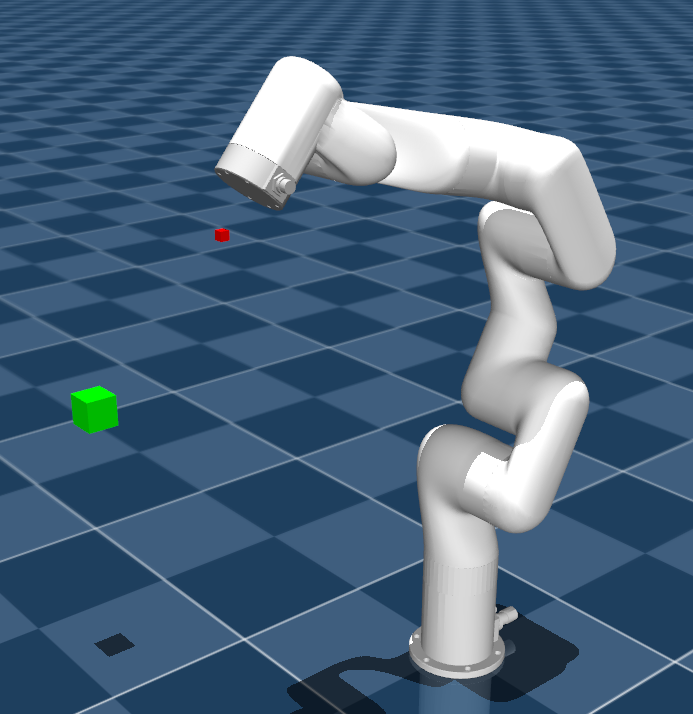

# Robot-Arm-Grasping

# Robot Arm Control Using Reinforcement Learning  
**Robot Learning Course Project**  
*Supervised by Professor Alex Mitrevski*  

---

## 📌 Overview  
This project explores **reinforcement learning (RL)** for controlling robotic arms, focusing on minimizing dependency on traditional kinematic models. By leveraging RL, we can develop control policies without requiring complete knowledge of the robot's dynamics, which are often complex to model mathematically.  

Two robotic arms are implemented and compared:  
1. **Franka Emika Panda** (simulation)  
2. **Xarm6** (simulation with real-world applicability)  

---

## 🎯 Key Contributions  
✔ **Joint-level control** instead of end-effector position control to reduce inverse kinematics dependency  
✔ **Adaptable RL framework** for different robotic platforms  
✔ **Sim-to-real potential** with Xarm6 implementation  

---

## ⚙️ Technical Setup  

### 📋 Dependencies  
```python
mujoco==2.3.3  
gymnasium==0.29.1  
gymnasium-robotics==1.2.2  
stable-baselines3==2.2.1  
```

### 🤖 Robotic Platforms  
| Franka Emika Panda | Xarm6 |
|--------------------|-------|
|  |  |

---

## 🏗️ Project Structure  
```
📂 /  
├── 📂 envs/                  # Custom Gym environments  
├── 📂 training/              # RL training scripts  
├── 📂 evaluation/            # Policy testing & metrics  
├── 📂 utils/                 # Helper functions  
├── 📂 models/                # Pretrained RL policies  
└── 📂 docs/                  # Experiment logs & reports  
```

---

## 🚀 Implementation Highlights  
🔹 **Modified RL approach** 
🔹 **Joint-space control** for more stable learning  
🔹 **Modular design** for easy adaptation to new robots  

---

## 📚 Learning Outcomes  
Through this project, I gained:  
✅ Hands-on experience with **RL for robotics**  
✅ Insights into **sim-to-real transfer** challenges  
✅ Understanding of **joint vs. Cartesian space control** tradeoffs  

---

## 🔜 Future Work  
- Real-world deployment on Xarm6  
- Integration with vision-based control  
- Multi-task learning for diverse manipulation  

---

*Developed for the Robot Learning course at Hochschule Bonn-Rhein-Sieg.*  
*Developed by **Othmane Elmekaoui***